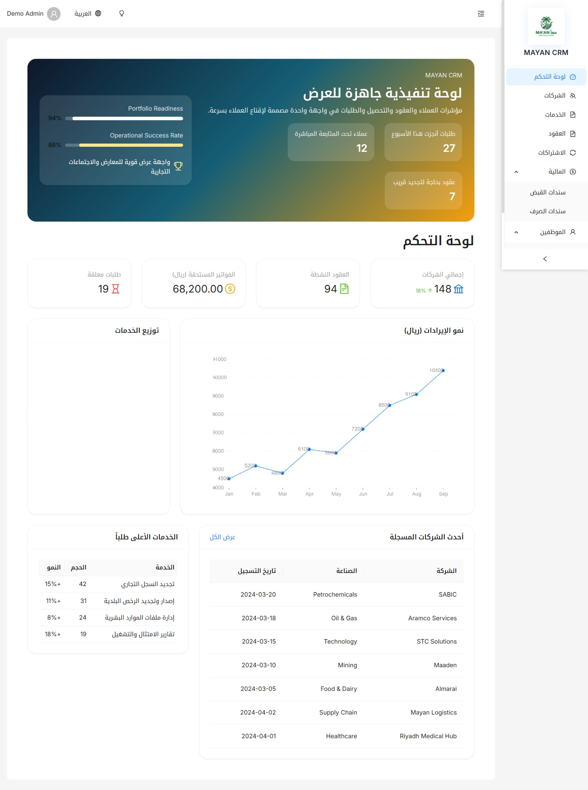
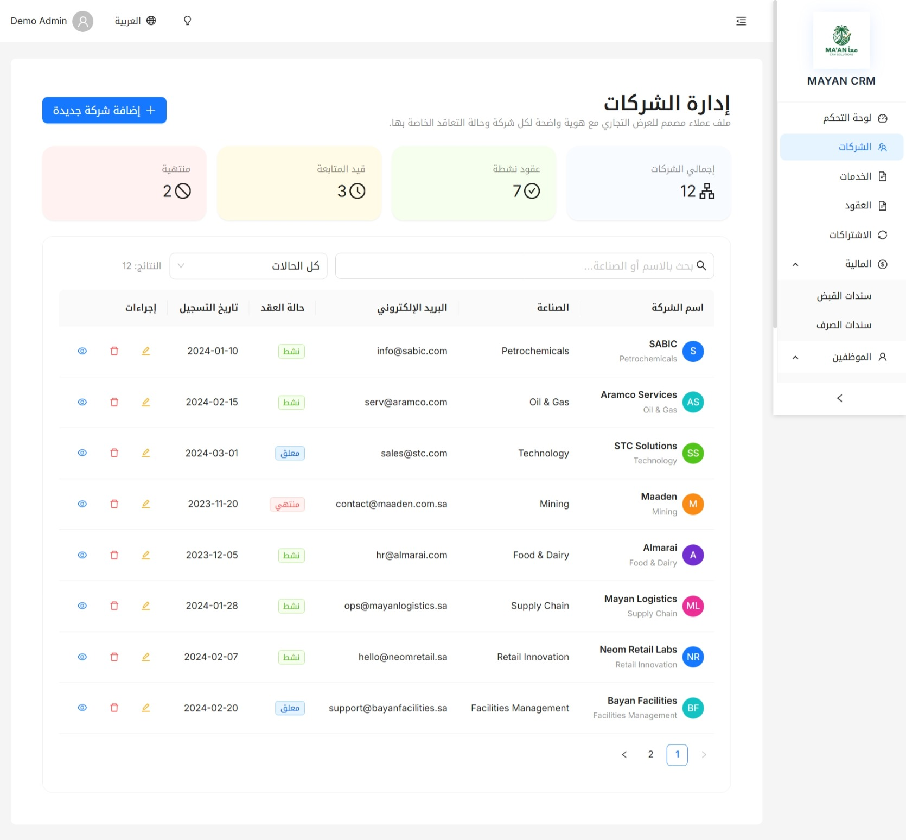
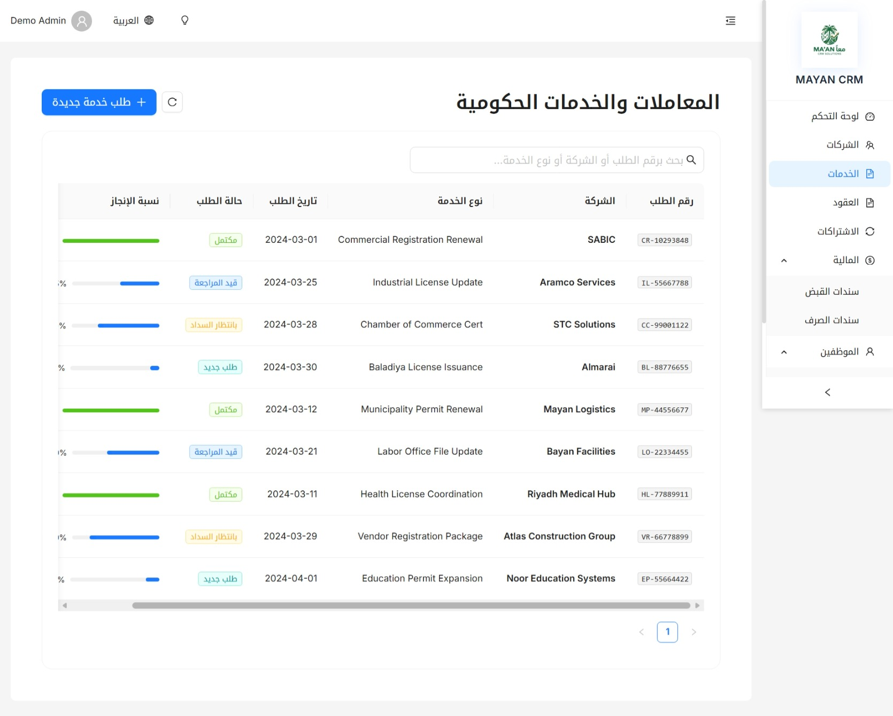
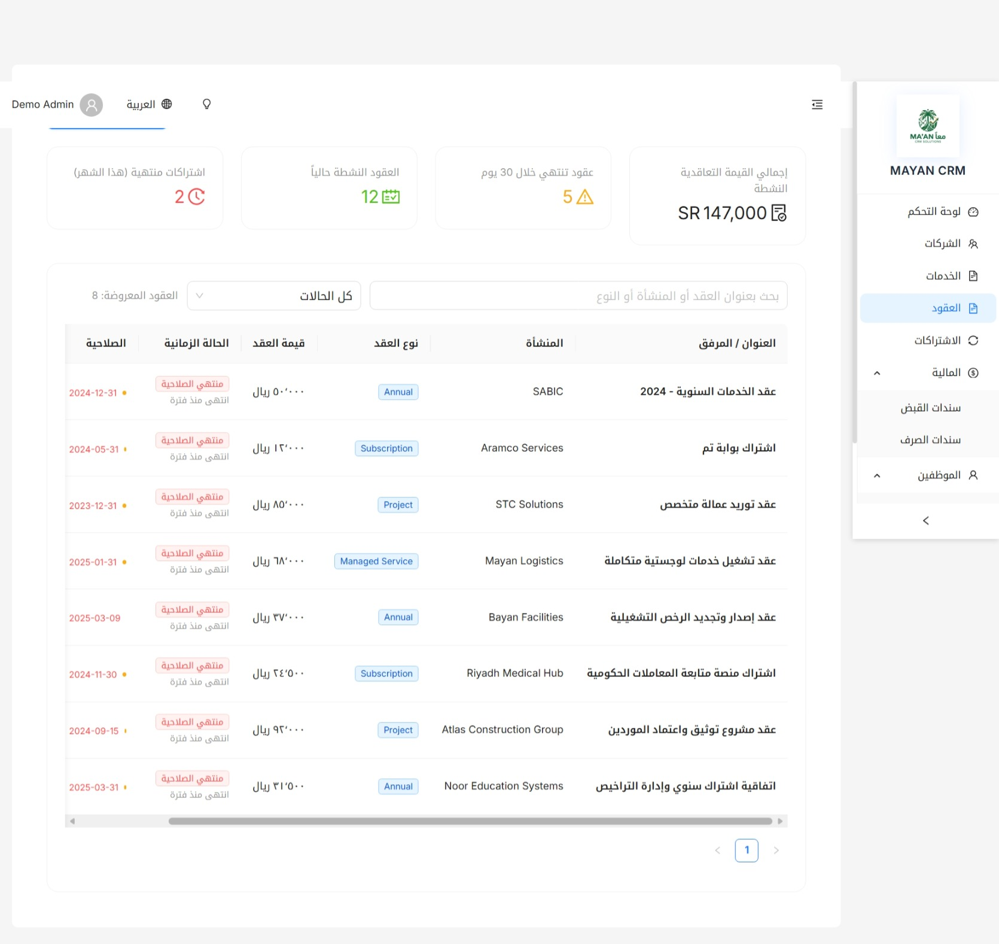
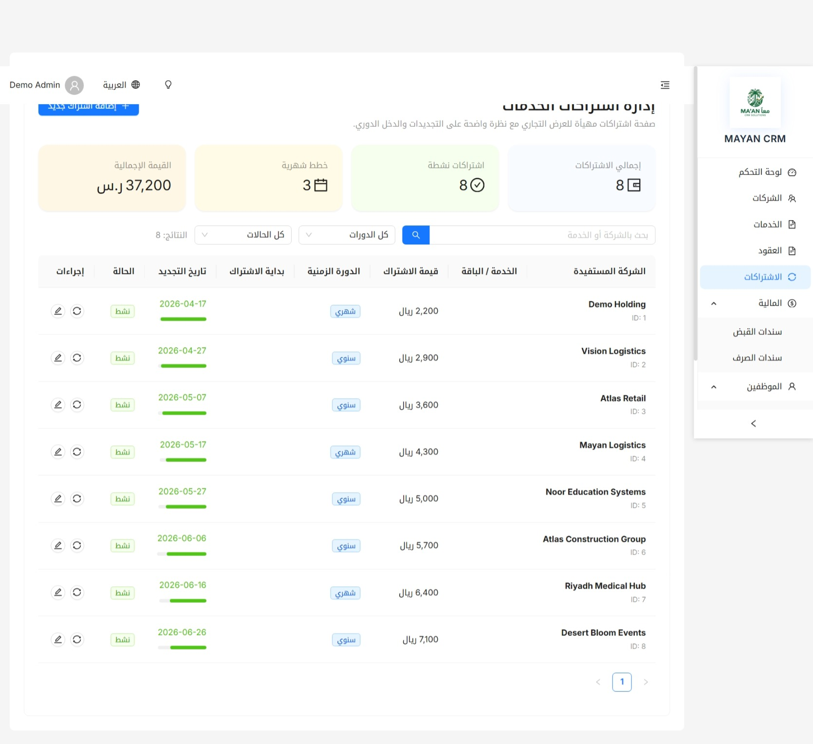
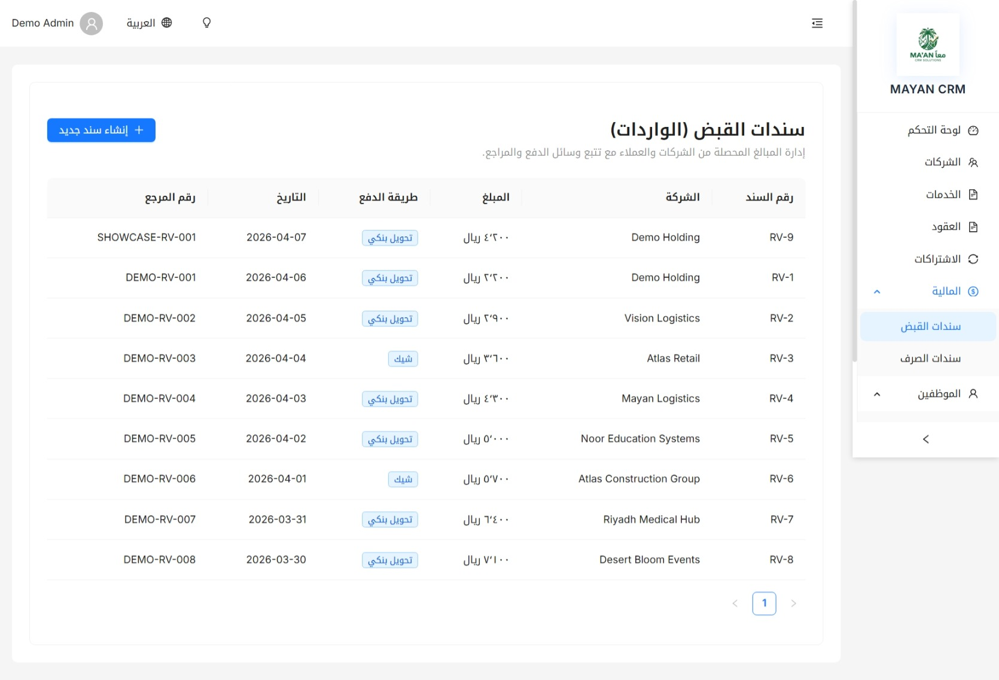
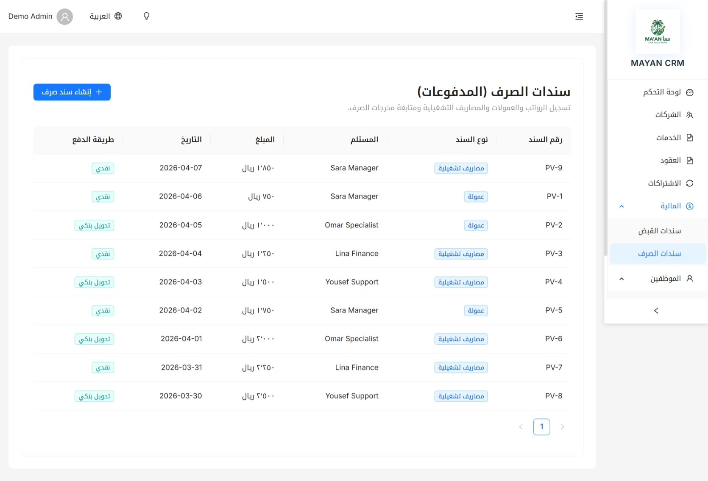
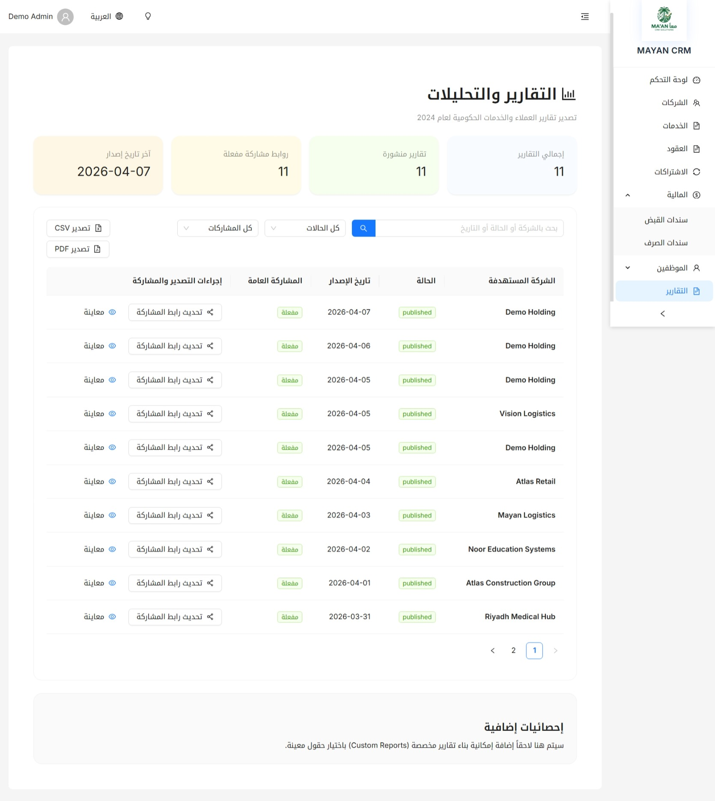
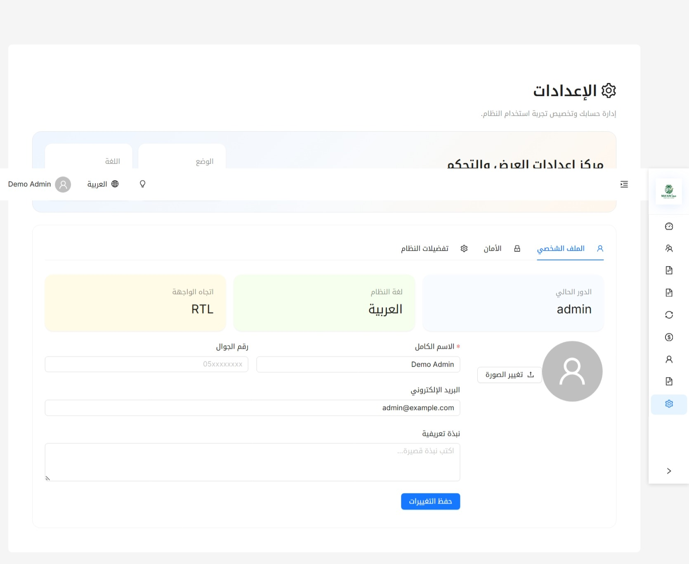

# MAYAN CRM

MAYAN CRM is a bilingual CRM platform built for showcasing and managing government business services.  
It combines a modern React frontend with a Django REST API, PostgreSQL, Redis, and Docker-based local development.

The project is designed to serve two goals:
- a practical back-office dashboard for contracts, finance, employees, and reports
- a polished portfolio-ready product demo for client presentations and exhibitions

## Overview

MAYAN CRM was designed as a modern business operations platform for managing:

- government service requests
- client companies and contracts
- recurring subscriptions
- financial vouchers and collections
- employees, permissions, and internal operations
- reports, exports, and public report sharing

It supports both Arabic and English, includes seeded showcase data, and is structured to run locally with Docker or live on Render.

## Product Preview

### Dashboard



### Companies



### Government Services



### Contracts



### Subscriptions



### Receipt Vouchers



### Payment Vouchers



### Employee Management



### Settings



## Highlights

- Arabic and English interface support
- Secure JWT-based authentication
- Dashboard with business KPIs and showcase metrics
- Company management with demo-ready client data
- Contracts and subscriptions management
- Receipt and payment voucher flows
- Employees, commissions, and service requests management
- Reports with sharing, CSV export, and PDF export
- Dockerized development environment
- Render deployment support via Blueprint

## Business Modules

- Dashboard and KPIs
- Company management
- Government services tracking
- Contracts management
- Subscriptions management
- Receipt vouchers
- Payment vouchers
- Employees and permissions
- Reports and analytics
- Account settings and localization

## Tech Stack

### Backend

- Django
- Django REST Framework
- Simple JWT
- PostgreSQL
- Redis
- Celery
- drf-spectacular
- django-modeltranslation

### Frontend

- React
- Vite
- Ant Design
- React Router
- TanStack Query
- Zustand
- i18next
- jsPDF

### DevOps

- Docker
- Docker Compose
- Nginx
- Render Blueprint

## Project Structure

```text
crm_project/
├─ apps/                  # Django apps
│  ├─ accounts/
│  ├─ companies/
│  ├─ contracts/
│  ├─ employees/
│  ├─ finance/
│  ├─ reports/
│  └─ services/
├─ config/                # Django settings and root config
├─ docker/                # Docker entrypoint and nginx config
├─ frontend/              # React/Vite frontend
├─ render.yaml            # Render Blueprint deployment
├─ docker-compose.yml     # Local multi-service setup
└─ DEPLOY_RENDER.md       # Deployment notes
```

## Main Features

### Dashboard

- executive summary cards
- revenue and operations overview
- showcase-oriented presentation layout

### Companies

- company directory
- status overview
- polished demo cards and listing view

### Contracts and Subscriptions

- contract lifecycle tracking
- subscription renewals
- status and expiry monitoring

### Finance

- receipt vouchers
- payment vouchers
- creation forms and list management

### Employees

- create, edit, delete, enable, and disable users
- admin-only password reset for staff
- commissions and requests tracking

### Reports

- public sharing links
- CSV export
- PDF export

## Screenshots Included In This Repository

The following screenshots are bundled inside [`docs/screenshots/`](./docs/screenshots/):

- dashboard
- companies
- services
- contracts
- subscriptions
- employees
- settings
- reports
- finance screens

## Demo Login

Local and demo deployments can be seeded with an admin account.

- Username: `admin`
- Password: set through `DEMO_ADMIN_PASSWORD`

## Local Development

### Requirements

- Docker Desktop
- Git

### Run with Docker

```bash
docker compose up --build -d
```

Then open:

- Frontend: [http://localhost/](http://localhost/)
- API docs: [http://localhost/api/v1/docs/](http://localhost/api/v1/docs/)

### Stop the project

```bash
docker compose down
```

## Environment Variables

Use `.env.example` as the starting point for your environment file.

Important variables:

- `SECRET_KEY`
- `DEBUG`
- `DATABASE_URL`
- `REDIS_URL`
- `ALLOWED_HOSTS`
- `CORS_ALLOWED_ORIGINS`
- `CSRF_TRUSTED_ORIGINS`
- `DEMO_ADMIN_USERNAME`
- `DEMO_ADMIN_PASSWORD`
- `DEMO_ADMIN_EMAIL`

## Deployment

This project includes a ready-to-use Render Blueprint:

- [render.yaml](./render.yaml)
- [DEPLOY_RENDER.md](./DEPLOY_RENDER.md)

Deploy flow:

1. Push the project to GitHub
2. Open Render
3. Create a new Blueprint
4. Select this repository
5. Fill required environment variables
6. Deploy the API, frontend, and database

## Portfolio Value

This project demonstrates:

- full-stack architecture with Django and React
- API design and frontend integration
- role-based admin workflows
- bilingual user experience
- Docker-based development workflow
- cloud deployment with Render
- product presentation quality for portfolio and client demos

## Testing

The repository includes backend tests under [tests/](./tests).

Example:

```bash
pytest
```

## Notes

- The frontend is a PWA, so after updates you may need a hard refresh with `Ctrl+F5`
- The project includes seeded demo data to make portfolio presentation easier
- The current deployment setup is optimized for demo and showcase use, then can be extended for production hardening

## Author

Built as a portfolio-ready CRM project for managing and presenting government business service workflows.
